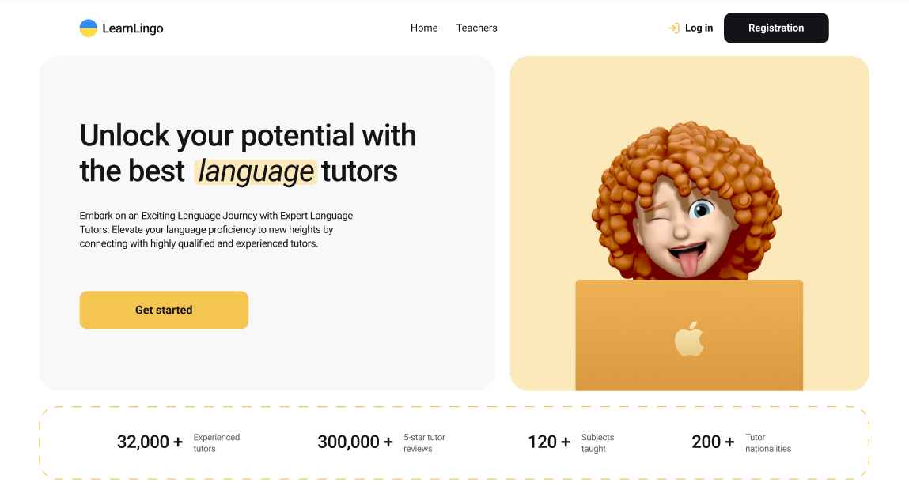
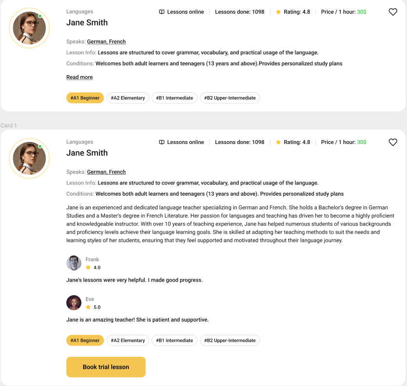
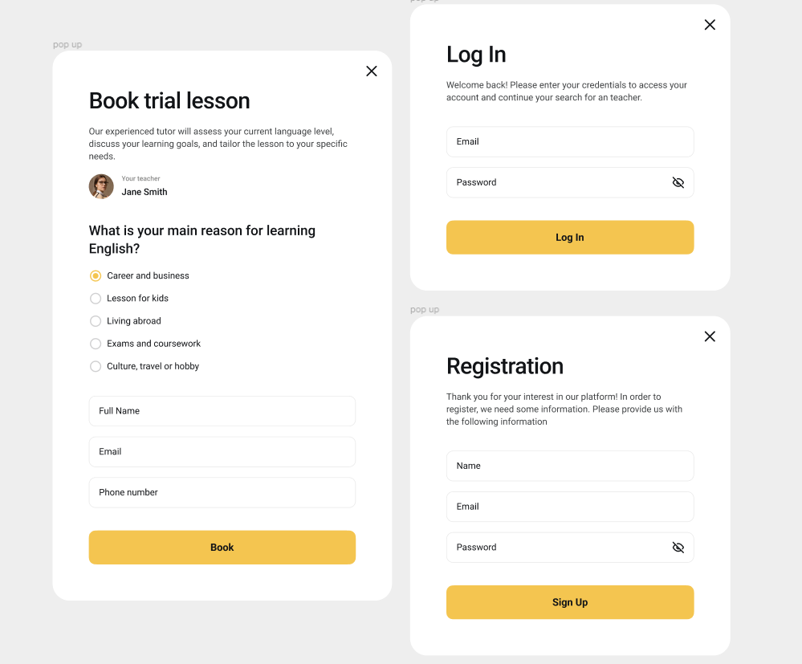

# Online Language Learning Platform

This project is an online platform for a language learning company that connects users with language teachers. The platform consists of three main pages:

- **Home Page**: Provides an overview of the company's services and includes a call-to-action button that redirects users to the "Teachers" page. The styling is implemented using a unique color palette inspired by the provided design mockup.

- **Teachers Page**: Displays a list of language teachers available for online lessons. Users can filter teachers based on the language they teach, the proficiency level of their students, and the price per hour of lessons.

- **Favorites Page**: A private page where users can view a list of teachers they have added to their favorites.

## Features

- **Authentication**: Implemented authentication functionalities using Firebase Authentication, including user registration, login, retrieval of user data, and logout.

- **Form Validation**: Utilized Formik and Yup for form validation, ensuring that all fields in the registration/login form are mandatory. Modal windows for registration/login forms can be closed by clicking the close button, clicking on the backdrop, or pressing the Esc key.

- **Realtime Database**: Created a collection in Firebase Realtime Database to store information about language teachers, including their name, surname, languages, proficiency levels, ratings, reviews, hourly rates, lessons completed, avatar URLs, lesson information, teaching conditions, and experience. Data can be populated using a provided JSON file.

- **Teacher Cards**: Implemented cards to display detailed information about each language teacher, following the design mockup provided. Each card includes options to add the teacher to favorites, read more details, and book a trial lesson.

- **Pagination**: Employed pagination on the backend to serve a limited number of teacher cards per page, with the option to load more cards upon user request.

- **Favorites Management**: Users can add or remove teachers from their favorites list. The state of the favorite button remains consistent even after page refresh for authenticated users.

- **Responsive Design**: Ensured that the application is responsive and compatible with various screen sizes.

- **Routing**: Utilized React Router for client-side routing, enabling navigation between different pages of the application.

- **Deployment**: Deployed the project on GitHub Pages for easy access and testing.

## Screenshots

## Author

- [Vladyslav Svitlychnyi](https://github.com/Svitly4nyi-Vla2yslav)

## Acknowledgments

Special thanks to Firebase for providing authentication and realtime database services for this project.

## License

This project is licensed under the MIT License - see the [LICENSE.md](./LICENSE.md) file for details.

<!-- # Car Rental Application

This project is a web application for a car rental company operating in Ukraine. The application allows users to browse through a catalog of available cars, filter them based on various criteria, view detailed information about each car, and add their favorite cars to a favorites list. The application also provides a contact option to connect with the company for car rental inquiries.

## Features

✅ 1. Home Page: Provides an overview of the services offered by the company. 

✅ 2. Catalog Page: Displays a catalog of cars available for rent, with filtering options by car brand, hourly rental price, and mileage.

✅ 3. Favorites Page: Shows a list of advertisements added by the user to their favorites.

🧑‍💻 4. Responsive Design: The application is designed to be responsive and compatible with different screen sizes.

## Technical Details

✅ - Frontend Framework: **TypeScript**
 
✅ - State Management: **Redux**

✅ - Routing: **React Router**

✅ - Styling: **Styled Components**

✅ - API Service: **Utilizes MockAPI for backend services**

✅ - HTTP Client: **Axios for making HTTP requests**

🧑‍💻 - Pagination: **Implemented on the backend to serve 12 advertisements per page**

✅ - Validation: **Ensures valid and semantic HTML**

✅ - Deployment: **Deployed on GitHub Pages**

## How to Run
To run this application locally, follow these steps:

1. Clone this repository to your local machine.

2. Install dependencies using `npm install`.

3. Start the development server using `npm start`.

### Screenshots

### Autor 

- [Vladyslav Svitlychnyi]("https://github.com/Svitly4nyi-Vla2yslav")

### Acknowledgments

Special thanks to MockAPI for providing backend services for this project.

### License

This project is licensed under the MIT License - see the [LICENSE.md](./LICENSE.md) file for details. -->
