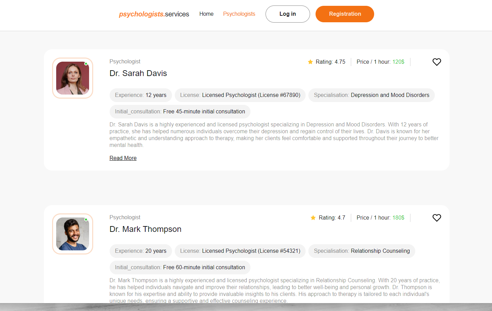

# Psychologists.Services - Online Platform for Psychological Services

This project is an online platform for a company that offers psychological services. It allows users to find and communicate with psychologists, view their profiles, and schedule consultations. The platform consists of three main pages:

- **Home Page**: Allows users to get general information about the company and navigate to the psychologists' page.
- **Psychologists Page**: Displays a list of psychologists available for consultations and allows filtering them by various criteria.
- **Favorites Page**: A private page where users can view their favorite psychologist profiles.

## Features

- **User Authentication**: Utilizes Firebase Authentication for user registration, login, fetching user data, and logout.
- **Form Validation**: Implements Formik and Yup for validating user registration/login forms.
- **Realtime Database**: Utilizes Firebase Realtime Database for storing data about psychologists and users.
- **Psychologist Cards**: Implements cards with information about each psychologist, following the design mockup.
- **Pagination**: Allows loading new psychologist cards upon user request.
- **Favorites Management**: Users can add/remove psychologists from their favorites list.
- **Design Consistency**: Ensures consistency with the design mockup across web pages.

## Screenshots

.png)

.png)

## Author

- [Vladyslav Svitlychnyi](https://github.com/Svitly4nyi-Vla2yslav)

## License

This project is licensed under the MIT License - see the [LICENSE.md](./LICENSE.md) file for details.
